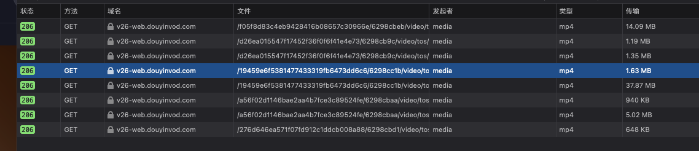

# README

**邢小林 xlxing@bupt.edu.cn** 

# 前言

本篇文章旨在研究**流媒体传输技术**，调查其演进趋势，以及探寻国内流媒体公司及其产品的技术实现。本文的叙述结构为：

1. 流媒体传输技术的应用场景与市场规模。
2. 多种流媒体传输技术的详细介绍，主要讲述在协议中的实现方式。
3. 探索国内流媒体公司采用的传输技术，主要通过抓包分析来论述。

> 数据来源：《2020年中国网络视频行业分析报告-市场规模现状与投资前景预测》

截至2019年6月，我国网络视频用户（含短视频）规模达7.59亿，较2018年底增长3391万，占网民整体的88.8%。其中长视频用户规模为6.39亿，占网民整体的74.7%；短视频用户规模为6.48亿，占网民整体的75.8%。可见，流媒体传输在网络中占有相当大的体量，然而面对复杂的网络环境，流媒体传输过程中可能会出现播放卡顿、丢帧的情况，如何对流媒体传输技术进行优化和改进，尽可能提高传输效率具有非常高的现实意义。

流数据具有数据量大、实时传输等特点，它对网络传输具有**高带宽**、**低时延**、**同步**和**高可靠性**的要求，为了保证好的QoS，传输模式、协议栈和应用体系控制等问题就显得非常重要，下面我将介绍若干流媒体传输协议或技术。

# 一 流媒体传输协议

当今流媒体传输技术解决方案主要有：RTSP（Real Time Streaming Protocol）实时串流协议、RTMP（Real Time Messaging Protocol）实时消息传送协议、HLS（HTTP Live Streaming）HTTP在线流传输协议。

## 1. RTSP（实时串流协议）

### 什么是RTSP？

RTSP是一种**应用层**协议，用于通过暂停和播放功能命令流媒体传输服务器。通过与服务器通信来实现流媒体的实时控制，本身没有实际传输数据。相反，RTSP服务器经常利用实时传输协议（RTP）和实时控制协议（RTCP）来传输实际数据。

当用户使用RTSP从IP摄像头发起视频流时，设备向流媒体服务器发送RTSP请求，这将启动安装过程。随后，可以使用RTP传输视频和音频数据。因此，您可以将RTSP看作是用于流媒体的电视遥控器，RTP充当广播本身。

### RTSP：快照

- 音频编码：AAC, AAC-LC, HE-AAC+ v1 & v2, MP3, Speex, Opus, Vorbis
- 视频编码：H.265, H.264, VP9, VP8
- 播放兼容性：没有被广泛支持，很少用于播放
- 优点：低时延，无处不在的IP摄像头
- 缺点：没有对体验质量和可伸缩性进行优化
- 时延：2秒
- 变体格式：RTSP作为一个总括术语，描述了RTP、RTCP、RTSPS（RTSP over SSL / Secure RTSP）和传统RTSP整个协议栈。

### RTSP请求

在协商和控制媒体传输时，RTSP使用以下命令，通常从客户端发送到服务器：

- **Option**：决定媒体服务器将接受哪些类型的请求
- **Describe**：标识URL和数据类型
- **Announce**：当客户机发送到服务器时，announce方法描述表示，并在从服务器发送到客户端时更新描述
- **Setup**：描述在发送播放请求之前必须如何传输流媒体
- **Play**：通过告诉服务器开始发送数据来启动媒体传输
- **Pause**：暂时停止流传递
- **Record**：启动媒体录制
- **Teardown**：完全终止会话并停止所有媒体流
- **Redirect**：通知客户端它必须连接到另一个服务器，通过提供一个新的URL给客户端发送请求。

### RTSP 历史

RTSP规范最初由Netscape、RealNetworks和哥伦比亚大学开发，于1998年由互联网工程工作组发布。2016年发布的2.0版本对早期版本进行了修改，以缩短与媒体服务器的往返通信。

在基于http协议的自适应比特率流媒体出现之前，RTSP和RTMP都支持互联网上的大多数流媒体。但由于两者都需要专用的服务器，它们并不适合大规模的广播。

因此，RTSP现在主要用作**贡献协议**。大多数工作流利用媒体服务器接收通过RTSP/RTP传输的流，然后将文件重新打包发送到观看设备（iPhone 智能电视）。

下一代的替代方案，如安全可靠传输(SRT)，正在直接与RTSP竞争视频贡献。即便如此，RTSP作为IP摄像头的实际标准仍然在监控工作流中流行。

## 2. RTMP（实时消息传送协议）

在流媒体的早期，实时消息协议（RTMP）是在互联网上传输视频是事实上的标准。RTMP是一种基于tcp的协议，旨在维护持久的、低延迟的连接，并扩展为流畅的流体验。

该协议最初是Adobe Flash Player直播和点播流媒体背后的秘密武器。因为这个流行的Flash插件在全盛时期支持98%的互联网浏览器，所以RTMP被广泛使用。

现在大多数编码器可以传输RTMP，大多数媒体服务器可以接收它。甚至像Facebook, YouTube和Twitch这样的大型社交媒体玩家也接受了这一点。然而，当RTMP流在流行的浏览器和设备上播放时，会遇到兼容性问题。

### 什么是RTMP？

RTMP规范是一种流协议，最初设计用于在专用服务器和Adobe Flash Player之间传输音频、视频和其他数据。RTMP曾经是专有的，但现在是一种开放的规范。

Adobe 的实时消息协议（RTMP）通过可靠的流传输，如TCP（RFC 0793）提供双向消息复用服务，旨在在一对通信对等方之间传输视频、音频和数据消息的并行流以及相关的定时消息。——Adobe

### RTSP：快照

- 音频编码：AAC, AAC-LC, HE-AAC+ v1 & v2, MP3, Speex
- 视频编码：H.264, VP8, VP6, Sorenson Spark®, Screen Video v1 & v2
- 播放兼容性：没有被广泛支持
  - 仅限于Flash Player（Adobe已停止维护），Adobe AIR，RTMP兼容播放器
  - 不兼容iOS，Android，大多数浏览器和大多数嵌入式播放器
- 好处：低时延，缓存小
- 缺点：不再更新和支持
- 延迟：5秒
- 变体格式：RTMPT（使用HTTP隧道），RTMPE（加密），RTMPTE（隧道和加密），RTMPS（通过SSL加密），RTMFP（传输层使用UDP而不是TCP）

### RTMP流如何工作

Macromedia（今天的Adobe System）开发了RTMP规范，用于音频和视频数据的高性能传输。RTMP在播放器客户端和服务器之间保持恒定的连接，允许协议充当管道并快速将视频数据移动到查看器。

因为RTMP位于传输控制协议（TCP）之上，所以在传输数据时使用三次握手。因此，RTMP非常可靠。

### RTMP流的历史

直到20世纪10年代初，Flash Player和RTMP一直是直播的主要交付机制。当结合使用时，这些技术支持闪电般的视频传输，延迟约为5秒。但是HTML5视频流，开放标准和自适应比特率传输最终在**最后一公里**传输中击败了RTMP流。

为什么？虽然RTMP工作得很好，但它过去遇到过**防火墙**问题。而且，作为一种**有状态协议**，RTMP还需要一个专用的流式服务器，这使得它的资源非常繁重。当Adobe宣布2020年12月之后不再对Flash进行维护时，RTMP正式开始衰弱。

业界现在倾向于使用基于HTTP协议的Web服务器。使用这些技术，可以允许本地服务器缓存流内容，从而提高可扩展性和观看体验。通过这一举措，自适应比特率流媒体变得更加普遍，使广播公司能够为观众的设备和连接优化内容。

支持Flash（扩展为RTMP）的设备比以往任何时候都少。用Adobe自己的话来说，鼓励内容分发厂商“将任何现有Flash内容迁移到新的开放格式“。

### 所以，RTMP已消亡？

Flash已停止维护，但RTMP并非消亡。RTMP编码器仍然是许多内容制作人的首选，在《2021视频流延迟报告》中，高达76.6%的受访者目前使用它进行摄取。

许多广播公司通过最初使用的RTMP对其直播进行编码，然后对内容进行转码，以便使用流媒体服务器或服务将内容交付给一系列的播放器和设备，从而克服了播放支持的局限性。

换言之，RTMP流媒体对于内容贡献来说仍有生命力，而且很生命力很旺盛。只是在最后一公里交付中不再被使用。

### 典型RTMP实时工作流

最常见的流媒体直播工作是RTMP到HLS。结合使用RTMP和HLS有助于最大限度地提高兼容性，而不会将延迟提高太多。该体系结构还允许广播公司在实时视频传输链的两端使用良好支持的协议。几乎所有的软件和硬件编码器都支持RTMP，几乎所有的播放端都支持HLS。

    
     
    
图1-直播点播工作流

### RTMP消化流替代品

虽然RTMP在第一公里贡献中很常见，但这种情况正在改变。业界领袖预测，像安全可靠传输（SRT）和Web实时通信（WebRTC）这样的开源协议可能成为标准协议。

**SRT**

SRT是一种开源技术，设计用于在不可预测的公共网络上可靠和低时延的流。作为第一公里的解决方案，它直接与RTMP和RTSP竞争，但仍在作为编码器、解码器和播放器添加支持而被使用。

“十多年前开发的实时消息协议（RTMP）等传统协议，用于编码视频，并将其跨网络传输到客户端，可能会被安全可靠传输（SRT）等更新等解决方案取代，后者旨在进一步减小延迟，满足直播和点播媒体的需求。”	——Deloitte

**WebRTC**

WebRTC是工作流中流行的接收协议，需要亚秒流或简单的、基于浏览器的发布。通过将RTMP编码器替换为基于WebRTC的视频源，可以消除对额外设备的需要。这使得只使用一个网络浏览器就可以很容易地无缝进行直播。

流媒体供应商也在努力通过创建WebRTC HTTP消化协议（WHIP），将WebRTC支持添加到编码软件和硬件中。

## 3. HLS（HTTP Live Streaming）

Adobe Flash最终在2020年底消亡，这就是为什么苹果的HTTP Live Streaming （HLS）协议成为向用户提供流媒体视频的首选方式。什么是HLS，它是如何工作的?

### 什么是HLS

HLS是一种自适应的基于http的格式，用于将视频和音频数据从媒体服务器传输到观看者的屏幕。无论你是通过手机上的应用程序观看直播，还是在智能电视上观看点播内容，HLS流媒体都有可能参与其中。如果你使用的是苹果设备，这种情况尤其可能发生。

在我们（WOWZA）的《2019年视频流延迟报告》中，超过45%的参与者表示，他们使用HLS协议进行内容分发。HLS比其他产品更受欢迎的原因在于播放兼容性和体验质量。这是因为所有Mac、Android、Microsoft和Linux设备都可以播放使用HLS传输的流。

有了HLS，内容分销商能够确保在广泛的设备上获得良好的观看体验，同时依靠内容分发网络(CDN)进行全球分发。传统上，规模和质量是以牺牲交付速度为代价的，但随着苹果发布低延迟HLS，这一切都改变了。

### Apple HLS快照

**总结**：

HLS是HTTP Live Streaming的缩写，是一种用于传输实时和点播流媒体内容的协议，它利用HTTP技术实现**可扩展性**和**自适应比特率**流媒体。

**特性**：

- 无状态
- 快速前进和倒退
- 交替音频和视频
- 回退
- 定时元数据
- 广告插入
- 内容保护

**时间线**：

- 2015年1月，微软宣布在Windows10中原生支持HLS
- 2016年6月，苹果宣布支持fMP4格式
- 2019年6月，苹果宣布了低时延HLS扩展规范
- 2020年5月，低时延HLS规范被纳入到总体HLS标准中

### HLS如何工作

HLS视频流被分解成数据段（也称为块或包），而不是作为连续的信息流交付。这与传统的流媒体传输方式不同，使得更高质量的流媒体能够接触到更多的观众。也就是说，它也会提高延迟，所以大多数内容发布者使用实时消息协议(RTMP)对他们的流媒体内容进行编码，然后在它到达媒体服务器后重新打包进行HLS交付。

**自适应比特率流的转码**

为了向所有观看的人提供最高质量的流媒体，包括那些屏幕小和连接不良的人，HLS流媒体会根据每个人的情况动态调整分辨率，这被称为自适应比特率流。它允许广播公司以出色的带宽和处理能力向用户提供高质量的流，同时也适应了速度和功率方面的不足。

不是以一个比特率创建一个直播流，而是使用转码器（通常位于媒体服务器中）创建不同比特率和分辨率的多个流。然后，服务器根据每个观看者的屏幕和连接速度发送最高分辨率的流。

创建单个流的多个版本有助于防止缓冲或流中断。另外，当观众的信号强度从两格变为三格时，流会动态调整以提供更好的呈现。

    
     
    
图2 自适应比特率视频传输

**交付和扩展**

不同于RTMP协议需要配合Flash Player使用，HLS可以轻松地通过全球内容分发网络（CDN），使用普通web服务器进行分发。通过在HTTP服务器网络上共享工作负载，CDN能够适应病毒式的观看峰值和超出预期的现场观众。CDN还通过缓存音频和视频片段来帮助改善观看者的体验。

相比之下，RTMP需要使用专用的流服务器，使得部署资源更加繁重。

### HTTP直播工具和服务

**HLS流服务器**

如上所述，大多数内容发布者使用流媒体服务器接收通过RTMP、WebRTC或SRT交付的内容，然后在视频到达服务器后使用HLS重新打包，其他格式（如MPEG-DASH）传输视频也是明智的做法，以确保各种设备的观众都能看到内容。

**内容分发网络（CDN）**

通过连接全球的服务器，CDN创建了高速公路，缩短了视频流从源头传送到终端用户所需的时间。对于任何面向大量观众或地理分布区域的流媒体，CDN对于可靠的内容交付至关重要。

**H5播放器**

最后，观众需要兼容的设备或者HTML5播放器。随着Adobe Flash的衰败，HLS已经成为事实上的标准，这意味着大多数设备和浏览器已经内置了这种功能。

### HLS流媒体技术综述

- **音频编码**：AAC-LC, HE-AAC+ v1 & v2, xHE-AAC, Apple Lossless, FLAC
- **视频编码**：H.265, H.264
- 播放兼容性：极好的，所有谷歌Chrome浏览器，Android、Linux、Microsoft和MacOS设备；一些机顶盒、智能电视和其他播放器
- 优点：自适应比特率，可靠的，广泛被支持
- 缺点：体验质量优先于低延迟（延迟高）
- 延迟：虽然HLS的传统延迟为6-30S，但低延迟HLS扩展现在已经被纳入HLS的功能集，承诺提供低于2秒的延迟

**容器格式**

与大多数使用MPEG-4 Part（MP4）容器格式基于http的协议不同，HLS最初指定使用MPEG-2传输流（TS）容器。这种情况在2016年发生了改变，当时苹果宣布支持碎片化的MP4（fMP4）格式。今天，fMP4是所有基于http的流媒体（包括MPEG-DASH和Microsoft Smooth）的首选格式。这些视频文件通常包含AVC/H.264编码的视频和AAC编码的音频。

**编码要求**

苹果提供了以下编码目标，作为使用HLS流媒体时典型的比特率变体集的势力。有关如何配置HLS流的更详细信息，请查看苹果的建议。

    
     
    
图3-HLS Encoding Targets

**.M3U8清单文件**

HLS视频片段将索引到流媒体播放列表中，以便视频播放器了解如何组织数据。还必须创建一个主.m3u8播放列表文件（可以将其视为索引到索引），以指导播放器如何在特定变体的播放列表之间进行跳转，这也称为清单文件。然后，任何交付流的人都可以通过web页面嵌入.m3u8引用URL或者创建下载该文件的应用程序来分发内容。

    
     
    
图4-HLS-M3U8

**切片大小和时延**

如上所述，通过HLS传输的视频流在流媒体服务器上被分解成数据切片。切片交付允许播放器根据可用资源在不同呈现方式之间切换，同时也减少了缓冲和其他中断。

在2016年之前，苹果一直推荐HLS使用10秒的分片。该规范还要求在播放开始前加载3个分片。如果坚持10秒分片大小，广播公司就会根据分片大小从30秒开始播放。苹果最终将默认片段长度减小到6秒，但这仍意味着“实时”流可能会延迟20秒。

减少延迟到一种流行方法是减小分片大小，称为“调优”HLS以实现低延迟。更短的数据块可以使下载时间更快，从而加快速度。但这并不是使用HLS实现快速流媒体的唯一途径。2019年，苹果宣布流名为Apple低时延HLS的扩展规格。最近，这个扩展已经作为一个新的特性集被纳入到总体HLS标准中。

### 苹果低时延HLS

苹果设计了低延时HLS扩展，以大幅度降低延迟。虽然该协议最初依赖于HTTP/2 PUSH交付，但这一要求已经被删除。此外，Internet工程组（IETF）最将将低延迟HLS扩展为一个特性集合并到传统HLS中。这有两方面的意义：它使新技术进一步标准化，并迫使技术供应商增加支持。

- 播放兼容性：任何不支持低延时HLS优化的播放器都可会退到标准HLS的行为
- 优点：低延时满足基于http流
- 缺点：作为一个新兴的规范，厂商仍然在实现支持的路上
- 延迟：3秒或者更短

请注意，不要把苹果的低延迟HLS与Periscope开发的开源低延迟HLS解决方案(LHLS)混为一谈。两者之间的主要区别是交付方式。与苹果的扩展不同，Periscope的版本使用了分块传输编码。视频开发者社区已经放弃了这个开源的替代方案，转而采用苹果的标准。

### HLS替代品

最后一公里交付的主要替代协议是MPEG-DASH和WebRTC。DASH在功能上与HLS非常相似，但缺乏对苹果设备的支持，而WebRTC则是完全不同的实时传输工具，在设计时没有考虑到可扩展性。

**HLS vs MPEG-DASH**

- 专有标准vs国际标准：HLS是苹果的私有标准，而DASH是MPEG制定的开源标准
- 播放兼容性：由于苹果在整个行业的巨大影响力，HLS比DASH得到了更广泛的支持
- 编解码器需求：HLS指定使用某些视频编解码器（H.265 H.264）和音频编解码器，而DASH的编解码器是不可知的。当使用更先进的编解码器时，这可以在更低的比特率下实现更高质量的广播。
- 容器格式：HLS传统上使用MPEG-2传输流容器格式，或者称为.ts（MPEG-TS），而DASH使用MP4格式，或称为.mp4
- 延迟：传统上，两种协议在交付速度方面都落后，但新的方法试图改变这一现状。对于DASH来说，它采用了通用媒体应用程序格式（CMAF），而苹果现在提供了低延迟HLS扩展。

**HLS vs WebRTC**

- 延迟：WebRTC流以500毫秒的传输速度在互联网上传播，甚至让低延迟的HLS都相形见绌
- 专有标准vs开源：HLS是苹果的私有标准，而WebRTC是开源且免费的
- 播放兼容性：WebRTC在大多数浏览器中不需要额外的插件或者软件，但HLS在移动设备中得到了更广泛的支持
- 可扩展性：可扩展性是HLS的游戏名称，而WebRTC却不能这么说（HLS才有扩展性这种说法，WebRTC是针对Web的，没有扩展性）
- 质量：使用WebRTC，实时交付优先于质量

### 什么时候不使用HLS

任何需要低于一秒交付的方案，例如网络会议、摄像头和无人机的试试设备控制或态势感知，都需要像WebRTC这样的协议。即使苹果的低时延HLS也有固定的延迟，在这些应用场景是不能接受的。

### 什么时候使用HLS

因为HLS是目前媒体流中使用最广泛的协议，所以它是大多数广播的安全赌注。任何在连接设备上播放流媒体的人至少应该考虑一下，尤其是在直播赛事和体育，质量是关键。延迟是值得考虑的，但随着苹果低延迟HLS功能集的集成，低于2秒的交付将变得更加普遍。这将使其适合于交互式流媒体、在线赌博、电子游戏等。

当向移动设备传输流媒体时，HLS是必须的。只要想想iPhone在手机领域扮演的角色就知道了。许多智能电视、机顶盒和播放器也默认使用HLS，所以想要接触客厅用户的广播公司也应该使用HLS。最后，对于那些仍然使用RTMP的人来说，是时候做出改变了。

也就是说，要达到尽可能广泛的受众，首先要适应额外的视频格式。通过将流转换为各种格式，您可以确保视频在任何设备上的可扩展性。

## 总结

当前最后一公里交付的流媒体主要使用的是HLS标准，它的可扩展性高，几乎支持所有的终端设备包括手机、智能电视、个人电脑等；自适应比特率，可以根据用户的网络状况无缝切换到合适的传输质量；传输流媒体基于http切片，便于CDN内容分发，快速快进和后退。此时，我们判断当前流媒体传输是HLS的天下。另外国际标准MPEG-DASH和HLS的技术架构基本一样，实现方式相似。RTSP、RTMP在最后一公里交付已经退出历史舞台。

## 二 国内互联网公司技术窥探

由上一章的信息，我们可以基本判定，当前提供流媒体服务的互联网公司在**交付段**使用HLS标准，下面我们从网络数据包入手，来验证我们的分析和猜测是否是正确的。

## 1. 腾讯视频

打开腾讯视频网页版，使用F12打开调试器。设置过滤类型为**媒体**，得到如下内容：

    
     
    
图5-腾讯视频-网络抓包

前三个http数据包的类型是mp4，分别是是11.74MB、8.57MB和5.03MB，经过验证，我发现这三个mp4的文件是开头的广告，腾讯视频开头的广告是多个广告组合在一起，直接复制GET的URL在Web中打开，可以看到播放广告。

从第4个http请求开始，发现是mp2t文件格式，这个其实就是数据分片，每一个分片的大小大约是1M。至于mp2t这个格式我这里不多探讨。查看消息头的信息，如下：

    
     
    
图6-腾讯视频-切片

可以看到**Filename**的地址的后缀是ts。

此外比对这么多ts文件的Filename信息，我发现这些ts是有索引信息的，这7个文件的index分别是1到7。

之后，我直接将鼠标切换到视频中间，可以发现又传输了若干个数据包，索引是90到93。这里就体现了HLS这种基于切片传输的优点，可以快速响应快进和快退，按需加载，根据需求从CDN拉视频流。

    
     
    
图6-腾讯视频-切片

## 2. 优酷视频

抓取优酷视频的数据包，点击一个视频，在播放广告的时候传输的数据包如下所示：

    
     
    
图7-优酷-播放广告

优酷视频就更明显了，第一个文件是m3u8，这个就是HLS的清单文件。后面的4个mp4文件也是广告，这个和腾讯视频一样。在这里还没有发现切片文件，经过查看，我发现优酷的视频流没有标注为**媒体**，设置过滤条件为**XHR**，可以看到有很多octet-stream的数据包，查看消息头，可以发现，这些请求的地址也是以ts为后缀，并且也是有序号，只不过这些序号不是索引的形式，而是体现在文件名的末尾：

    
     
    
图8-优酷-播放广告

很明显看到0015.ts，在对比前后的数据包，也是很整齐的序号排列。

## 3. 爱奇艺

至于爱奇艺，它的技术方案就有点奇怪，广告的格式是f4v，且是很多个小文件，这是Adobe Flash的那套技术啊，导致的结果就是，广告默认被浏览器屏蔽。

    
     
    
图9-爱奇艺-播放视频

之后播放视频的时候，发现Filename是ts。

## 4. 哔哩哔哩

之前哔哩哔哩的技术专家发布的专栏声明bi站已经全面引入DASH。在我看来DASH和HLS基本没有太大的差别，一个是Apple，一个是MPEG罢了。通过抓包也可以发现哔哩哔哩的视频都是小切片m4s，这是DASH的默认切片格式。

    
     
    
图10-哔哩哔哩-播放视频

## 5. 抖音

我也抓了抖音网页版，抖音的网页版则没有切片，但数据也是基于http传输的。抖音是短视频平台，平均每个视频的大小为1M左右，刚好是上述长视频的切片大小。所以，本身视频很短就没必要再切片了。抖音的技术特点是，短视频可以多次循环，所以完整视频拉下来缓存到本地。在观看当前视频时，提前缓存下一个视频，这一点在抓包时可以查看到。

    
     
    
图11-抖音网页版

## 6. 斗鱼直播

我点开网络查看器，没有发现数据包，只有大量的图片时使用http传输的，所以我猜测斗鱼的视频流是使用TCP或者UDP传输的，没有封装到http中来传输。

## 7 虎牙直播

虎牙直播和斗鱼差不多，看直播时，http查看器没有看到大量的数据包，可能和斗鱼采用的技术方案相似。

## 总结

通过简单地使用网页查看多个视频播放网站，基本可以断定长视频都采用了基于切片和http传输方案，HLS和DASH。而直播平台不能判断使用的技术方案。

此外，需要提醒的是，我只是使用网页进行简单地抓包，可能同一个平台，手机端和网页端采用不同的交付技术。但是HLS是可以支持多端的，并且拥有“指哪打哪”的优点，我认为长视频平台一定使用HLS或者DASH。

之后，我需要再使用专门的抓包工具，抓取手机端的数据包，查看移动端交付技术方案。

---

> https://datatracker.ietf.org/doc/rfc2326/

> RTSP信息汇总

[RFC2326](https://datatracker.ietf.org/doc/rfc2326/)

[最详细的音视频流媒体传输协议-rtsp协议详解](https://zhuanlan.zhihu.com/p/478736595)

[WOWZA-RTSP](https://www.wowza.com/blog/rtsp-the-real-time-streaming-protocol-explained)

[RTSP – All You Need to Know About Real-Time Streaming Protocol](https://corp.kaltura.com/blog/rtsp-streaming/)

RTSP由Real Networks和Netscape共同提出的如何有效地在IP网络上传输流媒体数据的应用层协议，该协议最早在1996年创立，并在rfc2326中对外公布。RTSP提供了一个可扩展的框架，以支持受控的、按需的实时数据传输，如音频和视频。数据源可以包括实时数据提要和存储的剪辑。该协议定义了一对多应用程序如何有效地通过IP网络传送多媒体数据。RTSP在体系结构上位于RTP和RTCP之上，它使用TCP和RTP完成数据传输。RTSP被用于建立的控制媒体流传输，它为多媒体服务扮演“网络远程控制”的角色。RTP不像http和ftp可完整地下载整个影视文件，它是以固定等数据率在网络上发送数据，客户端也是按照这种速度观看影视文件，当影视画面播放后，就不可以再重复播放，除非重新向服务端请求数据。如图1展示了RTSP的协议支持，需要注意的是RTSP主要使用RTP/RTCP传输数据，但是并不绑定。RTSP传输性能好，延时极低，但是该协议的播放兼容性差，当前的主要终端android和ios以及web浏览器都不支持，因此不应用在视频传输最后一公里。目前主要应用在一些实时视频流传输领域，包括：监控、无人机、闭路电视、IP摄像机等。

播放兼容性：差，没有被广泛支持，很少被用来视频播放

好处：低时延，无处不在的IP摄像机

缺点：没有对体验质量和可伸缩性进行优化

时延：<500ms

    
     
    
图1-RTSP协议支持

[WOWZA RTMP](https://www.wowza.com/blog/rtmp-streaming-real-time-messaging-protocol)

[dacast](https://www.dacast.com/blog/rtmp-real-time-messaging-protocol/)

RTMP英文全称Real Time Messaging Protocol实时消息传送协议，默认端口号1935。它是Adobe Systems公司为Flash播放器和服务器之间流数据传输开发的开放协议，flv是RTMP使用的封装格式。RTMP在播放器客户端和服务器端之间保持一个固定的连接，允许该协议充当管道，快速地将视频数据传输到查看器。RTMP是基于TCP来实现数据传输的，可靠性高。直到2010年代早期，Flash Player和RTMP一直是主要的流媒体交付机制。但是HTML5视频流、开放标准和自适应比特率传输最终在最后一公里传输时将RTMP流排挤出去。一是客户端需要安装Flash播放器，而Chrome、Edge、Firefox、Safari等主流浏览器纷纷不再支持flash。二是工业界现在主要支持HTTP协议，而RTMP传输的实时流是tcp数据包，和当下普遍使用CDN服务器不匹配，且有被防火墙过滤的风险。现在可以说Flash已经终结了，但是RTMP没有，RTMP编码器仍然是许多视频生产者的首选，在WOWZA的2021年视频流延迟报告中，高达76.6%的受访者使用它。换句话说，RTMP流媒体对于内容贡献来说是活着的，只是不是最后一公里的交付。

- RTMP是一种实时流媒体协议，它将视频文件从编码器传输到在线视频托管平台。
- RTMP原来在实时流中扮演的角色已经被HLS取代，但它现在扮演着另一个重要的角色。
- AAC-LC是RTMP编码最好的音频编解码器，但也支持AAC。
- H.264是RTMP编码最好的视频编解码器，但也支持MP4和x264。
- 广播更喜欢使用RTMP流，因为低时延。

RTSP和RTMP至今仍在使用，相较于以前的流媒体交付功能，它们现在扮演另一个重要的角色。

HLS英文全称HTTP Live Streaming在线流传输协议，该协议是由美国苹果公司实现的基于HTTP的流数据传输协议，最早版本在2009发布，可以实现流媒体的直播和点播，主要为iOS系统服务。HLS实际上并不是真正的实时流协议，HLS协议在服务器端将数据流存储为连续的、短时长的MPEG-TS格式文件，客户端不断下载并解析播放这些小文件从而实现实时流效果。HLS协议由三部分构成：HTTP、M3U8、TS。这三部分中，HTTP是数据传输协议，M3U8是索引文件，TS是音视频媒体数据。可以认为，HLS是以点播流技术方式来实现实时流的协议。作为一种基于HTTP的技术，不需要流媒体服务器，所有的切换逻辑都在播放器上。

HLS是当前最流行的流媒体传输协议，支持：

> https://developer.apple.com/documentation/http_live_streaming?language=objc

- 直播和预先录制的内容（视频点播）
- 以多个不同比特率的多个备选流
- 响应网络带宽变化的流的智能切换
- 媒体加密和用户鉴权

    
     
    
图3-HLS组成结构

RTMP协议在相当一段时间占据了流媒体传输的主要地位，但是本身存在一定的安全问题，客户端去flash，服务上CDN，防火墙过滤等背景下，已经难以继续发展。相反，HLS适应了时代的发展，使用HTTP传输流媒体数据，但是其技术实现的基础也决定了其高时延，不能满足低时延需求，且ts切片造成了海量小文件，对存储和缓存都有一定的挑战。在这样的背景下，HTTP-FLV综合了RTMP和HLS的优点，成为当下一个重要的流媒体传输解决方案。值得一提的是，HTTP-FLV是非正式的标准，主要在中国的互联网公司采用。

首先总结一下当前的流媒体传输环境：

1. 主流浏览器不支持flash插件
2. RTMP使用tcp协议传输流媒体数据，数据包可能会被防火墙过滤，不适应CDN
3. HLS时延高，无法满足低时延需求
4. FLV数据封装格式性能高，工业界服务器对FLV的支持度很高
5. 在服务端，RTMP流转换为FLV，因为RTMP几乎是当前唯一的推流方式

所有的HTTP-FLV流都是一个HTTP FLV地址，譬如：http://ossrs.net:8081/live/livestream.flv，但是流的形式却至少有三种：FLV文件、FLV伪流、FLV直播流。

HTTP-FLV流媒体传输技术有多个版本，简单理解可以视为使用http封装tcp的RTMP协议（但不同于RTMPT），融合了RTMP和HLS的优点，使用http长连接传输数据包，而不是tcp长连接，可以做到和RTMP一样的时延，同时用http协议传输数据包，可以避免被防火墙过滤。视频封装格式为flv，bilibili推出的flv.js，可以使用h5标签替代flash播放器。总而言之，http-flv性能上和RTMP类似，使用http协议传输，易于当下流行的cdn服务器分发，并且免去被防火墙拦截的风险，flv.js播放器又解决了当下主流浏览器不支持flash插件的问题。唯一的不足就是在手机浏览器上的支持非常有限。

> https://www.bilibili.com/read/cv855111?from=articleDetail

此外还有一种流媒体传输技术是DASH（Dynamic Adaptive Streaming over HTTP），是一种在互联网上传送动态码率的Video Streaming技术，类似于苹果的HLS，DASH会通过media presentation description（MDP）将视频内容切片成一个很短的文件片段，每个切片都有多种不同的码率，DASH Client可以根据网络情况选择一个码率进行播放，支持在不同码率之间无缝切换。Youtube采用DASH，其网页端及移动APP都使用了DASH。DASH的其他采用者包括：Netflix，Hulu。

DASH是由MPEG（Moving Picture Experts Group）组织制定，2010年开始启动，2011年11月发布Draft版本，2012年4月发布第一稿Version（ISO/IEC 23009-1:2012），2014年5月发布第二稿（ISO/IEC 23009-1:2014），最新稿（ISO/IEC 23009-3:2015）。 

目前3GPP Release 10已经将DASH纳入其中；在HbbTV1.5中也支持DASH；DVB-DASH也将DASH纳入到DVB（ETSI TS 103 285 v.1.1.1）。目前DASH Industry Forum由发起厂家组成，致力于推荐DASH产品生态，将DASH产业化和业界最佳实践推向批量应用。

    
     
    
图3-DASH样例系统

下面对以上提到的五种流媒体传输协议进行总结：

|           | 数据传输        | 常规时延 | 码率自适应 | 基于切片 | 应用场景与兼容性                              | 标准制定       |
| --------- | --------------- | -------- | ---------- | -------- | --------------------------------------------- | -------------- |
| RTSP      | RTP/RTCP（UDP） | 500ms    | 否         | 否       | 监控、无人机、潜艇、遥控车、IPTV              | IETF RFC标准   |
| RTMP      | TCP长连接       | <5s      | 否         | 否       | 直播推流、PC客户端、移动APP                   | Adobe          |
| HLS       | HTTP短连接      | >10s     | 是         | 是       | 直播点播，原生支持Apple软件，支持绝大多数设备 | Apple          |
| HTTP-FLV  | HTTP长连接      | <5s      | 是         | 否       | 直播、点播，QQ、微信、手机浏览器不支持        | 非标准协议     |
| MPEG-DASH | HTTP短连接      | 5-10s    | 是         | 是       | 直播、点播，所有的设备都支持                  | 国际标准组MPEG |

> https://blog.csdn.net/fanyun_01/article/details/121050196

随着Internet的日益普及，在网络上传输的数据已经不在局限于文字和图形，而且包含大量的音频和视频。

目前在网络上传输音频/视频（Audio/Video，简称A/V）等多媒体文件时，基本上只有**下载**和**流式传输**两种选择。通常来说，A/V文件占据的存储空间都比较大，在带宽受限的网络环境中下载可能要耗费数分钟甚至数小时，所以这种处理方法的延迟很大。如果换用流式传输的话，声音、影响、动画等多媒体文件由专门的流媒体服务器负责向用户连续、实时地发送，这样用户可以不必等到整个文件全部下载完毕，而只需要经过几秒钟的启动延时就可以了，当这些多媒体数据在客户机上播放时，文件的剩余部分将继续从流媒体服务器下载。

流（Streaming）是近年来在Internet上出现的新概念，其定义非常广泛，主要是通过网络传输**多媒体数据**的总称。流媒体包含广义和狭义两种内涵：广义上的流媒体指的是使音频和视频形成稳定和连续的传输流和回放流的一系列技术、方法和协议的总称，即流媒体技术；狭义上的流媒体是相对于传统的下载-回放方式而言的，指的是一种从Internet上获取音频和视频等多媒体数据的新方法，它能够支持多媒体数据流的**实时传输**和**实时播放**。通过运用流媒体传输技术，服务器能够向客户机发送稳定和连续的多媒体数据流，客户机在接收数据流的同时以一个稳定的速率回放，而不用等待全部下载完之后再进行回放。

由于受网络带宽、计算机处理能力和协议规范等方面的限制，要想从Internet上下载大量的音频和视频数据，无论从下载时间和存储空间上来讲都是不太现实的，而流媒体技术的出现则很好地解决了这一难题。目前实现流媒体传输主要有两种方法：**顺序流传输**和**实时流传输**，它们分别适合于不同的应用场合。

付费平台B2C：爱奇艺、腾讯视频、优酷视频

公开平台C2C：哔哩哔哩、YouTube

# 一 中国在线视频平台可以分为三大梯队

> 数据来源：《2020年中国网络视频行业分析报告-市场规模现状与投资前景预测》

据数据统计显示：截至2019年6月，我国网络视频用户（含短视频）规模达7.59亿，较2018年底增长3391万，占网民整体的88.8%。其中长视频用户规模为6.39亿，占网民整体的74.7%；短视频用户规模为6.48亿，占网民整体的75.8%。

2019年上半年，各大视频平台进一步细分内容产品类型，并对其进行专业化生产和运营，行业的娱乐内容生态逐渐形成。在用户细分时代，各大视频平台不断开拓新兴品类市场，更加注重内容的针对性和专业性。在网络视频内容领域，为迎合多样化的用户喜好，各大视频平台以电视剧、电影、综艺、动漫等核心品类为基础，不断向游戏、电竞、音乐等新兴品类拓展。此外，各大视频平台利用大数据、人工智能等技术，快速识别用户需求，实现内容的精准推送；同时，各大平台深入分析用户内容消费、商品消费的相关数据，还原用户真实需求，助力生产优质内容。例如，优酷的鱼脑系统已经被全面应用到网络剧、综艺节目的策划生产中。

第一梯队以爱奇艺、腾讯视频、优酷为首，分别背靠百度、腾讯、阿里巴巴三大互联网巨头，平台内容成本投入较大，综合片源丰富，活跃用户居于前列。

第二梯队包括以芒果TV、哔哩哔哩为代表的特色视频平台，其中前者背靠湖南卫视，拥有独家优质综艺内容，后者则通过“二次元”文化吸引了固定的用户群。

第三梯队以PP视频、搜狐视频、咪咕视频等为代表，主要走差异化路线，如PP视频主打体育内容，由于整体资金投入相对较少，难以前两个梯队的平台抗衡。

# 三 知名产品在线视频流传输协议调查

## 1、爱奇艺

通过抓包得知，爱奇艺视频播放使用的传输层技术是UDP，使用的是RTSP流媒体传输技术。

## 2、腾讯视频

HLS，可以看到 ts分片

## 3、优酷视频

HLS，可以看到ts分片，http传输mp2t格式的数据包

## 4、哔哩哔哩

HTTP-FLV && TCP

[HTML5 FLV Player](https://github.com/bilibili/flv.js)

[哔哩哔哩官方通告引入dash](https://www.bilibili.com/read/cv949156)

An HTML5 Flash Video (FLV) Player written in pure JavaScript without Flash. LONG LIVE FLV!

使用的视频流传输技术是http-flv，开源了flv.js，可以使用html5播放器播放flv视频，而不依赖flash插件。

# 四 直播平台

## 1 斗鱼直播

网上信息：http-flv

使用浏览器F12抓包，可以抓包m3u8，和ts

## 2 虎牙直播
## 2 虎牙直播

网上信息：http-flv

# 总结

目前国内的互联网厂商的在线视频流媒体传输技术主要以https为主，有很多显而易见的优点，包括易于实现，扩展性好，免于被防火墙过滤，可以适配CDN。RTMP是专门设计的流媒体传输协议，具有很好的传输效率和用户体验，并且事实上很长一段时间内成为了行业标准，是一套成熟的解决方案，但是该协议为adobe的私有协议，想要使用需要支付专利费用，维护方面配置专门的服务器，客户端安装flash插件（当下flash已经被浏览器抛弃）等。

在线视频的流媒体传输属于点播，对实时性要求不高，使用TCP技术门槛低，并且足够提供良好的服务。综合多种流媒体传输协议的优缺点，国内主流厂商普遍选择RTMP+HTTP混合的传输技术，即http-flv。在TCP/IP协议栈中，传输层协议是TCP，上层协议是http和rtmp。

# Reference

[WOWZA RTSP: The Real-Time Streaming Protocol Explained](https://www.wowza.com/blog/rtsp-the-real-time-streaming-protocol-explained)

[WOWZA RTMP Streaming: The Real-Time Messaging Protocol Explained](https://www.wowza.com/blog/rtmp-streaming-real-time-messaging-protocol)

[WOWZA What Is HLS(HTTP Live Streaming)](https://www.wowza.com/blog/hls-streaming-protocol)
