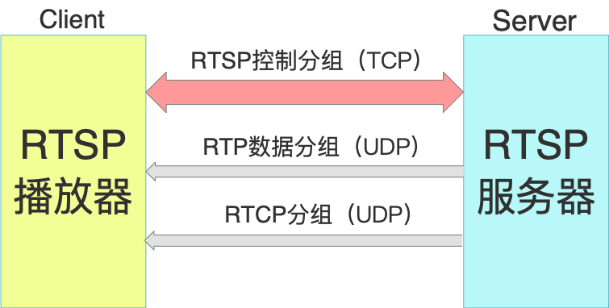
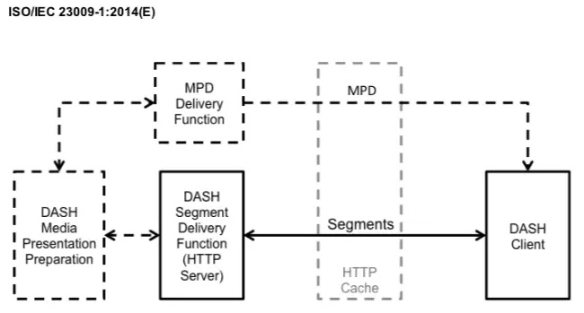

# 在线视频流媒体传输技术调研报告

**邢小林 xlxing@bupt.edu.cn** 

# 前言

本篇文章旨在研究**流媒体传输技术**演进趋势，调查当前使用的流媒体传输技术，以及国内流媒体公司及其产品的技术实现。本文的叙述结构为：

1. 流媒体传输技术的应用场景与市场规模。
2. 多种流媒体传输技术的详细介绍，主要讲述在协议中的实现方式。
3. 探索国内流媒体公司采用的传输技术，主要通过抓包分析来论述。

> 数据来源：《2020年中国网络视频行业分析报告-市场规模现状与投资前景预测》

截至2019年6月，我国网络视频用户（含短视频）规模达7.59亿，较2018年底增长3391万，占网民整体的88.8%。其中长视频用户规模为6.39亿，占网民整体的74.7%；短视频用户规模为6.48亿，占网民整体的75.8%。可见，流媒体传输在网络中占有相当大的体量，然而面对复杂的网络环境，流媒体传输过程中可能会出现播放卡顿、丢帧的情况，如何对流媒体传输技术进行优化和改进，尽可能提高传输效率具有非常高的现实意义。

流数据具有数据量大、实时传输等特点，它对网络传输具有**高带宽**、**低时延**、**同步**和**高可靠性**的要求，为了保证好的QoS，传输模式、协议栈和应用体系控制等问题就显得非常重要，下面我将介绍若干流媒体传输协议或技术。

当今流媒体传输技术解决方案主要有：RTSP（Real Time Streaming Protocol）实时串流协议、RTMP（Real Time Messaging Protocol）实时消息传送协议、HLS（HTTP Live Streaming）在线流传输协议、HTTP-FLV。下面将详细介绍这四种流媒体传输技术方案。

> https://datatracker.ietf.org/doc/rfc2326/

RTSP由Real Networks和Netscape共同提出的如何有效地在IP网络上传输流媒体数据的应用层协议，该协议最早在1996年创立，并在rfc2326中对外公布。RTSP提供了一个可扩展的框架，以支持受控的、按需的实时数据传输，如音频和视频。数据源可以包括实时数据提要和存储的剪辑。该协议旨在控制多个数据传输会话，提供了一种选择传输通道（如UDP、多播UDP和TCP）的方法，并且提供了一种基于RTP（RFC 1889）的选择传输机制的方法。RTP不像http和ftp可完整地下载整个影视文件，它是以固定等数据率在网络上发送数据，客户端也是按照这种速度观看影视文件，当影视画面播放后，就不可以再重复播放，除非重新向服务端请求数据。如图1展示了RTSP的协议支持，需要注意的是RTSP主要使用RTP/RTCP传输数据，但是并不绑定。RTSP传输性能好，延时极低，目前主要应用在一些实时视频流传输领域，包括：视频监控、无人机、潜艇和视频通话等。由于当前互联网软件对高并发的需求，CDN技术已经广泛应用，而CDN对流媒体传输主要支持RTMP协议和HTTP协议，因此RTSP协议并不广泛使用在当前流行的点播、直播场景。

    
     
    
图1-RTSP协议支持

RTMP英文全称Real Time Messaging Protocol实时消息传送协议，默认端口号1935。它是Adobe Systems公司为Flash播放器和服务器之间流数据传输开发的开放协议，flv是RTMP使用的封装格式。rtmp 数据需要专门的服务器接收， 如FMS, awazal等，然后通过本地的 Flash 播放器播放，一整套技术解决可以概括为：**RTMP、FLV、Flash**，分别代表数据传输，数据封装，数据解析。这一套视频流传播技术成熟，传输性能高，早期几乎所有的浏览器都内置了flash player插件，国内最早的优酷网、土豆网都使用了RTMP技术来实现视频点播。RTMP在传输层使用的是**tcp长连接**，一般在网络环境较好的情况下，传输质量好，时延低，一般在1-3秒，广泛使用在直播、点播领域。该协议也存在很大的缺点，一是客户端需要安装Flash播放器，而Chrome、Edge、Firefox、Safari等主流浏览器纷纷不再支持flash。二是RTMP传输的实时流是tcp数据包，和当下普遍使用的CDN服务器不匹配，且有被防火墙过滤的风险。

HLS英文全称HTTP Live Streaming在线流传输协议，该协议是由美国苹果公司实现的基于HTTP的流数据传输协议，最早版本在2009发布，可以实现流媒体的直播和点播，主要为iOS系统服务。HLS实际上并不是真正的实时流协议，HLS协议在服务器端将数据流存储为连续的、短时长的MPEG-TS格式文件，客户端不断下载并解析播放这些小文件从而实现实时流效果。HLS协议由三部分构成：HTTP、M3U8、TS。这三部分中，HTTP是数据传输协议，M3U8是索引文件，TS是音视频媒体数据。可以认为，HLS是以点播流技术方式来实现实时流的协议。

HLS支持：

> https://developer.apple.com/documentation/http_live_streaming?language=objc

- 直播和预先录制的内容（视频点播或VOD）
- 以多个不同比特率的多个备选流
- 响应网络带宽变化的流的智能切换
- 媒体加密和用户鉴权

    
     
    
图3-HLS组成结构

RTMP协议在相当一段时间占据了流媒体传输的主要地位，但是在客户端去flash，服务上CDN，防火墙过滤等背景下，已经难以继续发展。相反，HLS适应了时代的发展，使用HTTP传输流媒体数据，适应了CDN，也不需要flash播放器，但是其技术实现的基础也决定了其高时延，不能满足低时延需求，且ts切片造成了海量小文件，对存储和缓存都有一定的挑战。在这样的背景下，HTTP-FLV综合了RTMP和HLS的优点，成为当下一个重要的流媒体传输解决方案。

首先总结一下当前的流媒体传输环境：

1. 主流浏览器不支持flash插件
2. RTMP使用tcp协议传输流媒体数据，数据包可能会被防火墙过滤，不适应CDN
3. HLS时延高，无法满足低时延需求
4. FLV数据封装格式性能高，且多年RTMP的流行，工业界服务器对FLV的支持度很高

HTTP-FLV流媒体传输技术可以视为使用http封装tcp的RTMP协议（但不同于RTMPT），融合了RTMP和HLS的优点，使用http长连接传输数据包，而不是tcp长连接，可以做到和RTMP一样的时延，同时用http协议传输数据包，可以避免被防火墙过滤。视频封装格式为flv，bilibili推出的flv.js，可以使用h5标签替代flash播放器。总而言之，http-flv性能上和RTMP类似，使用http协议传输，易于当下流行的cdn服务器分发，并且免去被防火墙拦截的风险，flv.js播放器又解决了当下主流浏览器不支持flash插件的问题。唯一的不足就是在手机浏览器上的支持非常有限。

> https://www.bilibili.com/read/cv855111?from=articleDetail

此外还有一种流媒体传输技术是DASH（Dynamic Adaptive Streaming over HTTP），是一种在互联网上传送动态码率的Video Streaming技术，类似于苹果的HLS，DASH会通过media presentation description（MDP）将视频内容切片成一个很短的文件片段，每个切片都有多种不同的码率，DASH Client可以根据网络情况选择一个码率进行播放，支持在不同码率之间无缝切换。Youtube采用DASH，其网页端及移动APP都使用了DASH。DASH的其他采用者包括：Netflix，Hulu。

DASH是由MPEG（Moving Picture Experts Group）组织制定，2010年开始启动，2011年11月发布Draft版本，2012年4月发布第一稿Version（ISO/IEC 23009-1:2012），2014年5月发布第二稿（ISO/IEC 23009-1:2014），最新稿（ISO/IEC 23009-3:2015）。 

目前3GPP Release 10已经将DASH纳入其中；在HbbTV1.5中也支持DASH；DVB-DASH也将DASH纳入到DVB（ETSI TS 103 285 v.1.1.1）。目前DASH Industry Forum由发起厂家组成，致力于推荐DASH产品生态，将DASH产业化和业界最佳实践推向批量应用。

    
     
    
图3-DASH样例系统

下面对以上提到的五种流媒体传输协议进行总结：

|          | 数据传输        | 常规时延 | 码率自适应 | 基于切片 | 兼容性 | 应用场景与兼容性                              | 国际标准化与演进趋势              |
| -------- | --------------- | -------- | ---------- | -------- | ------ | --------------------------------------------- | --------------------------------- |
| RTSP     | RTP/RTCP（UDP） | <1s      | 否         | 否       |        | 监控、无人机、潜艇、遥控车、IPTV              | RFC标准，使用率低                 |
| RTMP     | TCP长连接       | <5s      | 是         | 否       |        | 直播推流、PC客户端、移动APP                   | Adobe私有，使用率逐渐下降         |
| HLS      | HTTP短连接      | >10s     | 是         | 是       |        | 直播点播，原生支持Apple软件，支持绝大多数设备 | Apple私有，当前使用率高，发展趋势 |
| HTTP-FLV | HTTP长连接      | <5s      | 是         | 否       |        | 直播、点播，QQ、微信、手机浏览器不支持        | Adobe私有                         |
| DASH     | HTTP短连接      | 5-10s    | 是         | 是       |        | 直播、点播，所有的设备都支持                  | 国际标准，未来发展前景好          |

第一梯队以爱奇艺、腾讯视频、优酷为首，分别背靠百度、腾讯、阿里巴巴三大互联网巨头，平台内容成本投入较大，综合片源丰富，活跃用户居于前列。

第二梯队包括以芒果TV、哔哩哔哩为代表的特色视频平台，其中前者背靠湖南卫视，拥有独家优质综艺内容，后者则通过“二次元”文化吸引了固定的用户群。

第三梯队以PP视频、搜狐视频、咪咕视频等为代表，主要走差异化路线，如PP视频主打体育内容，由于整体资金投入相对较少，难以前两个梯队的平台抗衡。

2、流媒体传输协议：

基于UDP：

- RTP(Real-time Transport Protocol)、RTCP(Real-time Transport Control Protocol)

现在Google推出的WebRTC

基于TCP：

- RTMP(Real Time Messaging Protocol)
- HLS(HTTP Live Streaming)

> https://blog.csdn.net/fanyun_01/article/details/121050196

随着Internet的日益普及，在网络上传输的数据已经不在局限于文字和图形，而且包含大量的音频和视频。

目前在网络上传输音频/视频（Audio/Video，简称A/V）等多媒体文件时，基本上只有**下载**和**流式传输**两种选择。通常来说，A/V文件占据的存储空间都比较大，在带宽受限的网络环境中下载可能要耗费数分钟甚至数小时，所以这种处理方法的延迟很大。如果换用流式传输的话，声音、影响、动画等多媒体文件由专门的流媒体服务器负责向用户连续、实时地发送，这样用户可以不必等到整个文件全部下载完毕，而只需要经过几秒钟的启动延时就可以了，当这些多媒体数据在客户机上播放时，文件的剩余部分将继续从流媒体服务器下载。

流（Streaming）是近年来在Internet上出现的新概念，其定义非常广泛，主要是通过网络传输**多媒体数据**的总称。流媒体包含广义和狭义两种内涵：广义上的流媒体指的是使音频和视频形成稳定和连续的传输流和回放流的一系列技术、方法和协议的总称，即流媒体技术；狭义上的流媒体是相对于传统的下载-回放方式而言的，指的是一种从Internet上获取音频和视频等多媒体数据的新方法，它能够支持多媒体数据流的**实时传输**和**实时播放**。通过运用流媒体传输技术，服务器能够向客户机发送稳定和连续的多媒体数据流，客户机在接收数据流的同时以一个稳定的速率回放，而不用等待全部下载完之后再进行回放。

由于受网络带宽、计算机处理能力和协议规范等方面的限制，要想从Internet上下载大量的音频和视频数据，无论从下载时间和存储空间上来讲都是不太现实的，而流媒体技术的出现则很好地解决了这一难题。目前实现流媒体传输主要有两种方法：**顺序流传输**和**实时流传输**，它们分别适合于不同的应用场合。

付费平台B2C：爱奇艺、腾讯视频、优酷视频

公开平台C2C：哔哩哔哩、YouTube

# 一 中国在线视频平台可以分为三大梯队

> 数据来源：《2020年中国网络视频行业分析报告-市场规模现状与投资前景预测》

据数据统计显示：截至2019年6月，我国网络视频用户（含短视频）规模达7.59亿，较2018年底增长3391万，占网民整体的88.8%。其中长视频用户规模为6.39亿，占网民整体的74.7%；短视频用户规模为6.48亿，占网民整体的75.8%。

2019年上半年，各大视频平台进一步细分内容产品类型，并对其进行专业化生产和运营，行业的娱乐内容生态逐渐形成。在用户细分时代，各大视频平台不断开拓新兴品类市场，更加注重内容的针对性和专业性。在网络视频内容领域，为迎合多样化的用户喜好，各大视频平台以电视剧、电影、综艺、动漫等核心品类为基础，不断向游戏、电竞、音乐等新兴品类拓展。此外，各大视频平台利用大数据、人工智能等技术，快速识别用户需求，实现内容的精准推送；同时，各大平台深入分析用户内容消费、商品消费的相关数据，还原用户真实需求，助力生产优质内容。例如，优酷的鱼脑系统已经被全面应用到网络剧、综艺节目的策划生产中。

第一梯队以爱奇艺、腾讯视频、优酷为首，分别背靠百度、腾讯、阿里巴巴三大互联网巨头，平台内容成本投入较大，综合片源丰富，活跃用户居于前列。

第二梯队包括以芒果TV、哔哩哔哩为代表的特色视频平台，其中前者背靠湖南卫视，拥有独家优质综艺内容，后者则通过“二次元”文化吸引了固定的用户群。

第三梯队以PP视频、搜狐视频、咪咕视频等为代表，主要走差异化路线，如PP视频主打体育内容，由于整体资金投入相对较少，难以前两个梯队的平台抗衡。

# 三 知名产品在线视频流传输协议调查

## 1、爱奇艺

通过抓包得知，爱奇艺视频播放使用的传输层技术是UDP，使用的是RTSP流媒体传输技术。

## 2、腾讯视频

HLS，可以看到 ts分片

## 3、优酷视频

HLS，可以看到ts分片，http传输mp2t格式的数据包

## 4、哔哩哔哩

HTTP-FLV && TCP

[HTML5 FLV Player](https://github.com/bilibili/flv.js)

An HTML5 Flash Video (FLV) Player written in pure JavaScript without Flash. LONG LIVE FLV!

使用的视频流传输技术是http-flv，开源了flv.js，可以使用html5播放器播放flv视频，而不依赖flash插件。

# 四 直播平台

## 1 斗鱼直播

网上信息：http-flv

使用浏览器F12抓包，可以抓包m3u8，和ts

## 2 虎牙直播
## 2 虎牙直播

网上信息：http-flv

# 总结

目前国内的互联网厂商的在线视频流媒体传输技术主要以https为主，有很多显而易见的优点，包括易于实现，扩展性好，免于被防火墙过滤，可以适配CDN。RTMP是专门设计的流媒体传输协议，具有很好的传输效率和用户体验，并且事实上很长一段时间内成为了行业标准，是一套成熟的解决方案，但是该协议为adobe的私有协议，想要使用需要支付专利费用，维护方面配置专门的服务器，客户端安装flash插件（当下flash已经被浏览器抛弃）等。

在线视频的流媒体传输属于点播，对实时性要求不高，使用TCP技术门槛低，并且足够提供良好的服务。综合多种流媒体传输协议的优缺点，国内主流厂商普遍选择RTMP+HTTP混合的传输技术，即http-flv。在TCP/IP协议栈中，传输层协议是TCP，上层协议是http和rtmp。
